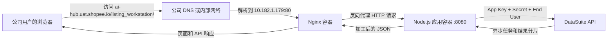
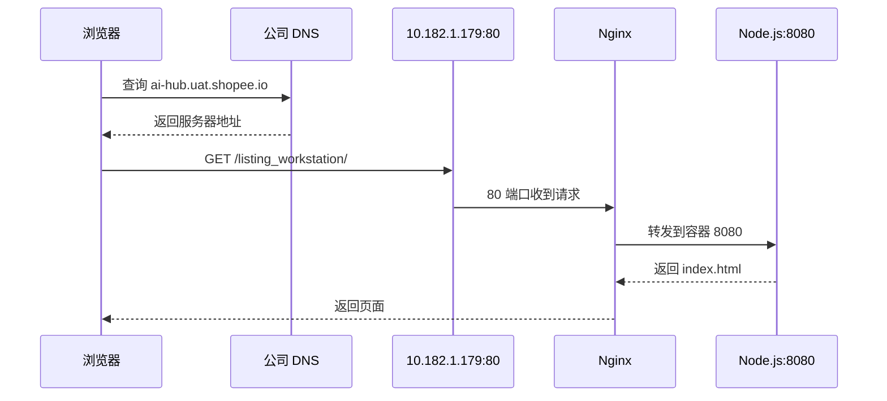

# 从 Vibe Coding 到公司服务器上线：Listing Workstation 实战手册

> 适用读者：希望把本地生成的网页或内部工具，改造成可维护服务并通过公司域名提供给同事使用的开发者、数据分析师和业务团队。
>
> 本文以 Listing Workstation 的真实上线过程为案例。所有凭证均使用占位符，禁止把真实 Token、App Secret、证书或密码写入本文和 Git 仓库。

## 1. 学完这份文档后可以做到什么

完成本文的实践后，你应该能够：

1. 判断一个 Vibe Coding 原型是否能够直接放到服务器运行。
2. 把依赖 Google Apps Script 和 Google Sheet 队列的页面，改造成浏览器主动调用后端 API 的服务。
3. 把第三方 API 凭证保留在服务器端，不暴露给浏览器和 GitHub。
4. 使用 GitHub 管理代码版本，并安全地把代码传到服务器。
5. 使用 Docker Compose 启动应用和 Nginx。
6. 理解 `localhost`、服务器 IP、端口、Nginx、DNS 和公司域名之间的关系。
7. 从单元测试、容器、反向代理、域名到真实页面点击，逐层验证上线结果。
8. 定位常见问题，例如 clone 失败、网页拒绝连接、页面能打开但没有数据、接口超时和卖家列表为空。

## 2. 这次项目最终交付了什么

项目名称：`Listing Workstation`

代码仓库：`https://github.com/rogertu-rgb/listing-workstation`

服务器：`10.182.1.179`

访问地址：`http://ai-hub.uat.shopee.io/listing_workstation/`

最终能力：

- 用户在页面输入完整 GGP Name。
- 用户点击“查询”按钮，浏览器向同域后端发起请求。
- Node.js 服务使用服务器上的 DataSuite 凭证查询数据。
- 服务将原始数据加工成 Zone 摘要和商品推荐。
- Nginx 通过 80 端口提供页面，并把 API 请求转发给 Node.js。
- GitHub 中不包含 DataSuite Secret、GitHub Token 或服务器凭证。
- Docker 容器和 Nginx 均可自动重启并提供健康检查。

真实验收用例：`深圳市菲德越科技有限公司 - GGP`

验收结果：

- API 返回 HTTP 200。
- 返回 67 行源数据。
- 生成 6 个 Zone。
- 生成 67 个推荐商品。
- 页面渲染 6 行机会摘要，首屏展示 20 个商品卡片。

## 3. 先理解最终架构



关键理解：

- 浏览器不直接持有 DataSuite Secret。
- 浏览器不访问服务器的 `localhost`。
- Nginx 是外部入口，Node.js 是内部应用服务。
- 域名负责让用户找到服务器，Nginx 负责把请求交给应用。
- 同一个项目路径同时提供前端和 `/listing_workstation/api/*`，浏览器不需要额外处理跨域。

## 4. 原始 Vibe Coding 原型为什么不能直接部署

原始文件包括：

- `Index (3).html`
- `Code.gs`
- `appsscript.json`

原始页面通过 `google.script.run` 调用 Apps Script 函数，后端还使用了 `SpreadsheetApp`、Script Properties 和 Google Sheet 队列。

这套逻辑在 Google Apps Script 托管环境内可以运行，但把 HTML 文件复制到普通服务器后会出现问题：

1. 普通浏览器页面没有 `google.script.run` 运行时。
2. 普通 Node.js 服务器没有 `SpreadsheetApp`。
3. Sheet 队列依赖轮询、触发器和特定 Google 权限。
4. 如果把 DataSuite Secret 写进前端 JavaScript，任何访问页面的人都能看到。
5. Apps Script 的执行时间、网络和部署模型与普通服务器不同。

因此不能只做“上传 HTML”这一步。需要先把应用边界重新设计为：

```text
前端 HTML -> HTTP API -> Node.js 后端 -> DataSuite
```

## 5. 全流程总览

| 阶段 | 做什么 | 目的 | 完成标志 |
|---|---|---|---|
| 0 | 明确需求和依赖 | 避免把原型假设带到服务器 | 能画出旧架构和新架构 |
| 1 | 建立凭证边界 | 防止 Secret 进入 Git 和浏览器 | `.env` 被忽略，仓库无密钥 |
| 2 | 将 Apps Script 改为 Node API | 解除对 Google 运行时的依赖 | `/api/health` 可响应 |
| 3 | 接入 DataSuite | 让服务器直接获得业务数据 | 测试卖家返回真实结果 |
| 4 | 改造前端查询交互 | 让请求由用户明确触发 | 点击查询后显示进度和结果 |
| 5 | 增加测试与防护 | 让改造可验证、可维护 | `npm test` 通过 |
| 6 | Docker 化 | 固化运行环境 | 容器健康运行 |
| 7 | 创建 GitHub 仓库并推送 | 形成版本来源 | 远端有脱敏代码和提交历史 |
| 8 | 进入公司服务器 | 获得部署执行入口 | PAM 终端可以执行命令 |
| 9 | 将代码放到服务器 | 建立服务器工作目录 | 服务器有完整项目文件 |
| 10 | 配置服务器 `.env` | 向运行时注入真实凭证 | 健康接口显示已配置 |
| 11 | 启动 Docker Compose | 运行应用和代理 | 两个容器均为 healthy |
| 12 | 配置 Nginx | 暴露标准 Web 入口 | 服务器 80 端口可访问 |
| 13 | 绑定公司域名 | 让同事通过稳定链接访问 | 域名页面可打开 |
| 14 | 分层验收 | 证明整条链路真实可用 | 页面点击真实用例成功 |
| 15 | 建立更新和回滚流程 | 支持后续迭代 | 能安全发布新版本和回退 |

## 6. Step 0：明确需求、输入和运行边界

### 做了什么

先确认以下内容：

- 页面需要查询的业务对象是完整 GGP Name。
- 真实测试值是 `深圳市菲德越科技有限公司 - GGP`。
- 业务数据来自 DataSuite API。
- DataSuite 需要 App Key、App Secret、Scope、System Name 和 End User。
- 页面部署到公司服务器，不再依赖 Google Sheet 队列。
- 卖家列表期望每天刷新一次。
- 最终需要 Docker 部署和公司可访问链接。

### 目的

Vibe Coding 最容易出现的问题不是代码不能运行，而是隐藏了运行环境假设。先列出输入、输出、权限、网络和刷新方式，才能知道哪些部分需要保留，哪些部分必须替换。

### 如何验证完成

团队成员能够回答：

1. 谁发起查询？用户点击按钮。
2. 谁持有 Secret？服务器。
3. 谁调用 DataSuite？Node.js 后端。
4. 页面如何访问后端？同域 `/listing_workstation/api/growth-recommendation`。
5. Google Sheet 是否仍在主查询链路中？否。

### 完成后可以做到什么

可以开始编码，而不会把 Secret 放错位置，也不会继续维护不需要的 Sheet 监听逻辑。

## 7. Step 1：建立凭证目录和脱敏规则

### 做了什么

本地使用独立凭证目录，例如：

```sh
mkdir -p ~/.config/listing-workstation
chmod 700 ~/.config/listing-workstation
touch ~/.config/listing-workstation/credentials.env
chmod 600 ~/.config/listing-workstation/credentials.env
```

凭证文件只保存占位结构的真实值：

```dotenv
GITHUB_TOKEN=<fine-grained-github-token>
DATASUITE_APP_KEY=<datasuite-app-key>
DATASUITE_APP_SECRET=<datasuite-app-secret>
DATASUITE_END_USER=<company-email>
ADMIN_TOKEN=<random-admin-token>
```

项目只提交 `.env.example`，不提交 `.env`。当前 `.gitignore` 和 `.dockerignore` 均排除了真实环境文件。

### 目的

代码和凭证有不同生命周期：

- 代码需要分享、审查和版本管理。
- 凭证只能给获授权的运行环境使用，并且需要轮换。

把二者分离后，仓库可以公开或分享，而不会连带暴露业务系统权限。

### 关键原则

1. 不把 Token 写进 Git remote URL。
2. 不把 Secret 写进 Dockerfile。
3. 不把 Secret 写进前端 HTML 或 JavaScript。
4. 不在截图、聊天或教程中粘贴真实值。
5. 曾经在聊天、终端历史或提交中暴露的 Token 应立即吊销并重建。
6. GitHub 推送凭证和服务器部署凭证应分开，权限遵循最小化原则。

### 如何验证完成

```sh
git check-ignore .env
git grep -n -I -E 'github_pat_|APP_SECRET|DATASUITE_APP_SECRET=.+'
git status --short
```

预期结果：

- `.env` 被 Git 忽略。
- 仓库中没有真实 Token 或 Secret。
- `.env.example` 只有空值或安全示例。

### 完成后可以做到什么

可以安全推送代码，并允许本地、UAT 和生产环境使用各自的凭证。

## 8. Step 2：把 Apps Script 后端改造成 Node.js HTTP API

### 做了什么

新建 Node.js 服务，主要路由为：

```text
GET  /api/health
GET  /api/initial-data
POST /api/growth-recommendation
POST /api/admin/refresh-sellers
```

主查询接口接收：

```json
{
  "sellerName": "深圳市菲德越科技有限公司 - GGP"
}
```

Node.js 同时负责提供静态前端文件，因此页面和 API 使用同一个 Origin。

### 目的

替换 Apps Script 特有能力：

| Apps Script 方式 | 服务器方式 |
|---|---|
| `google.script.run` | 浏览器 `fetch('/api/...')` |
| `PropertiesService` | 服务器环境变量 |
| `UrlFetchApp.fetch` | Node.js HTTP 请求 |
| `SpreadsheetApp` 队列 | 后端直接调用 DataSuite |
| Apps Script Web App | Node.js HTTP Server |

### 原理

HTTP API 是前端和后端之间的稳定协议。前端只知道请求字段和响应字段，不需要知道 OAuth、任务轮询和结果分片细节。

### 如何验证完成

本地启动：

```sh
npm start
curl -fsS http://127.0.0.1:8080/api/health
```

预期至少看到：

```json
{
  "ok": true,
  "service": "listing-workstation"
}
```

### 完成后可以做到什么

HTML 页面不再依赖 Google Apps Script，可以部署到任何能够运行 Node.js 或 Docker 的服务器。

## 9. Step 3：在后端直接接入 DataSuite API

### 做了什么

后端实现以下流程：

1. 使用 App Key 和 App Secret 获取 OAuth Token。
2. 使用卖家名作为 `request_param_1` 提交 DataSuite 查询。
3. 获取异步 Job ID。
4. 轮询任务状态。
5. 读取结果分片。
6. 合并行数据。
7. 按 Zone 聚合并生成页面所需结构。
8. 可选调用 LLM 生成摘要，失败时使用确定性摘要兜底。

### 目的

让一次用户查询直接对应一次数据服务调用，消除以下中间状态：

- 写入 Google Sheet。
- 等待 Sheet 监听器。
- 轮询 Sheet 中的状态列。
- 从 Sheet 读取结果。

### 原理

DataSuite 查询不是简单的同步下载，而是“提交任务、等待执行、读取多个 shard”。这些复杂性属于后端，不应暴露给浏览器。

后端超时设置为 10 分钟，Nginx 读取超时设置为 660 秒，代理不会在 DataSuite 正常执行期间提前断开。

### 如何验证完成

```sh
curl -fsS -X POST \
  http://127.0.0.1:8080/api/growth-recommendation \
  -H 'Content-Type: application/json' \
  --data '{"sellerName":"深圳市菲德越科技有限公司 - GGP"}'
```

检查：

- HTTP 状态为 200。
- `seller_name` 与输入一致。
- `meta.data_mode` 为 `direct_datasuite_api`。
- `meta.source_rows` 大于 0。
- `meta.zone_count` 大于 0。
- `meta.errors` 为空。

### 完成后可以做到什么

服务器可以独立完成真实业务查询，不再需要 Google Sheet 作为请求队列或结果缓存。

## 10. Step 4：把前端改成“点击查询”显式触发

### 做了什么

前端增加紧邻 GGP Name 输入框的“查询”按钮，并统一查询入口：

1. 用户输入完整 GGP Name。
2. 点击查询按钮，或按 Enter。
3. 页面将按钮设为 disabled，避免重复提交。
4. 页面显示“DataSuite 处理中”。
5. 请求完成后显示行数、Zone 数、商品数和耗时。
6. 失败时显示明确错误状态。
7. 选择候选卖家只填入输入框，不自动触发昂贵查询。

### 目的

旧页面把候选选择和查询绑定在一起，而且没有候选列表时 Enter 不会提交。用户会误以为“已经查了但没展示”。

显式按钮让用户清楚知道：

- 是否已经提交。
- 当前是否仍在执行。
- 请求是否成功。
- 成功返回了多少数据。

### Impeccable 产品设计原则如何影响这一步

这个页面是内部业务工具，设计服务于任务。采用以下原则：

- 昂贵请求必须由用户明确发起。
- 状态反馈靠近触发控件。
- 成功反馈使用可核验的业务数字，不使用装饰性动画。
- 交互使用熟悉的输入框、按钮、禁用态和状态文本。

### 如何验证完成

浏览器端到端操作：

1. 打开页面。
2. 输入 `深圳市菲德越科技有限公司 - GGP`。
3. 确认尚未点击时不会自动查询。
4. 点击“查询”。
5. 确认按钮在处理中不可重复点击。
6. 等待状态变为“查询状态：成功”。
7. 确认页面出现 Zone 摘要和商品卡片。

本次真实结果：

```text
查询完成：深圳市菲德越科技有限公司 - GGP，返回 67 行、6 个 Zone
推荐结果已生成：67 个商品
```

### 完成后可以做到什么

用户不需要理解后端技术，就能够可靠地发起一次查询并判断结果是否完整。

## 11. Step 5：增加测试、输入限制和错误边界

### 做了什么

- 使用 Node.js 内置测试运行器。
- 为数据聚合逻辑增加测试。
- 请求体限制为 64 KiB。
- 卖家名限制为 300 字符。
- 管理刷新接口要求 Bearer Token。
- 生产环境不把内部异常和 Secret 返回给前端。
- LLM 失败不会让主查询失败。

### 目的

Vibe Coding 能快速得到功能，但上线前必须把“正常路径”扩展为“可控路径”：错误有边界、输入有限制、外部依赖失败时有退路。

### 如何验证完成

```sh
npm test
git diff --check
```

预期结果：

- 全部测试通过。
- 没有语法或空白错误。
- 缺少 `sellerName` 时返回 400。
- 未配置凭证时返回 503，而不是进程崩溃。

### 完成后可以做到什么

团队可以放心迭代代码，并在发布前快速发现基础回归。

## 12. Step 6：使用 Docker 固化运行环境

### 做了什么

创建 `Dockerfile`：

- 使用 Node 22 Alpine 镜像。
- 将应用复制到 `/app`。
- 使用非 root 的 `node` 用户运行。
- 暴露 8080。
- 使用 `/api/health` 做容器健康检查。

创建 `docker-compose.yml`，包含：

- `listing-workstation` 应用容器。
- `listing-workstation-nginx` 代理容器。
- `listing-workstation-data` 命名卷。
- `restart: unless-stopped` 自动恢复策略。

### 目的

Docker 把 Node 版本、目录结构、启动命令和健康检查固定下来，减少“本地能运行，服务器不能运行”的环境差异。

### 端口策略

```yaml
application:
  ports:
    - "127.0.0.1:8080:8080"

nginx:
  ports:
    - "80:80"
```

含义：

- Node 8080 只允许服务器本机访问。
- 对外入口只有 Nginx 的 80。
- 用户不会直接访问 8080。

### 如何验证完成

```sh
docker compose up -d --build
docker compose ps
docker compose logs --tail=100 listing-workstation
curl -fsS http://127.0.0.1:8080/api/health
```

### 完成后可以做到什么

任何安装了 Docker Compose 的目标服务器都能使用同一套方式启动应用。

## 13. Step 7：创建 GitHub 仓库并安全推送

### 做了什么

1. 创建仓库 `listing-workstation`。
2. 初始化 Git。
3. 提交脱敏后的源代码。
4. 设置远程仓库。
5. 推送 `main` 分支。

关键提交：

| Commit | 内容 |
|---|---|
| `9244ef6` | 建立 DataSuite 直连服务、前端、Docker 和测试 |
| `538db3f` | 将应用统一命名为 Listing Workstation |
| `007d7b9` | 增加 Nginx 反向代理 |
| `516bac5` | 改为用户显式点击查询并完善状态反馈 |

### 目的

GitHub 是服务器部署的代码来源，也是变更记录和回滚依据。服务器不应成为唯一代码副本。

### 推荐的本地认证方式

如果安装了 GitHub CLI：

```sh
set -a
source ~/.config/listing-workstation/credentials.env
set +a
printf '%s' "$GITHUB_TOKEN" | gh auth login --hostname github.com --with-token
git push origin main
unset GITHUB_TOKEN
```

不要使用：

```text
https://<token>@github.com/owner/repo.git
```

因为 Token 可能进入 shell 历史、Git 配置和日志。

### 如何验证完成

```sh
git status --short
git log -1 --oneline
git remote -v
git ls-remote origin HEAD
```

预期：

- 工作区干净。
- 本地最新 Commit 与 GitHub 一致。
- Remote URL 中没有 Token。

### 完成后可以做到什么

服务器可以通过 clone 或 pull 获得代码，团队也可以审查每次变更。

## 14. Step 8：通过 PAM 进入公司服务器

### 做了什么

使用公司 Space PAM 页面打开目标服务器终端：

```text
Server: 10.182.1.179
Server SN: GoogleCloud-4177699461CC7B40C9B1A0D7C76C7B13
Role: sro
```

### 目的

PAM 提供经过认证和审计的服务器入口。网页显示服务器“可用”只表示资源存在，不代表应用已经部署，也不代表端口和域名已经配置。

### 进入服务器后先检查

```sh
whoami
hostname
pwd
docker --version
docker compose version
curl -I https://github.com
```

### 如何验证完成

- 终端能执行命令。
- 当前角色对目标部署目录有写权限。
- Docker 可用。
- 服务器能够访问 GitHub 和 DataSuite 所需网络。

### 完成后可以做到什么

可以在服务器上建立项目目录、配置环境变量并启动容器。

## 15. Step 9：把 GitHub 代码放到服务器

### 推荐标准路径：clone 和 pull

首次部署：

```sh
git clone https://github.com/rogertu-rgb/listing-workstation.git
cd listing-workstation
git rev-parse --short HEAD
```

后续更新：

```sh
cd listing-workstation
git fetch origin
git pull --ff-only origin main
git rev-parse --short HEAD
```

### 为什么最初 clone 会失败

当仓库是 Private 时，服务器终端没有 GitHub 读取凭证。PAM 登录解决的是服务器身份，不会自动赋予 GitHub 权限。

把仓库改成 Public 后，读取代码不再需要 Token，因此 clone 可以使用普通 HTTPS URL。

对于正式的 Private 仓库，推荐使用：

1. 只读 Deploy Key。
2. 细粒度、只读、仅限单仓库的 PAT。
3. 公司批准的 CI/CD 或 GitHub App。

不要把个人高权限 GitHub Token 长期放在业务服务器上。

### 本次实际使用过的更新兜底方式

在交互式 PAM 终端操作不稳定时，使用 GitHub Public Archive 下载新版本并覆盖应用文件，然后重新构建容器。

这个方法适合临时恢复，不是长期首选，因为它缺少完整 Git 工作区和清晰的 pull 历史。标准流程仍应使用 clone 和 pull。

### 如何验证完成

```sh
test -f package.json
test -f docker-compose.yml
test -f nginx/default.conf
git rev-parse --short HEAD
```

如果使用 Archive，最后一条 Git 命令可能不可用，应改为记录下载版本的 Commit SHA。

### 完成后可以做到什么

服务器拥有一个可以构建的确定版本，后续可以根据 Commit SHA 追踪发布内容。

## 16. Step 10：在服务器创建 `.env`

### 做了什么

```sh
cp .env.example .env
chmod 600 .env
```

然后只在服务器终端填写真实值：

```dotenv
DATASUITE_APP_KEY=<server-secret>
DATASUITE_APP_SECRET=<server-secret>
DATASUITE_END_USER=<company-user-email>
ADMIN_TOKEN=<random-long-token>
```

### 目的

容器镜像保持通用，运行环境通过 `.env` 注入不同配置。服务器删除或更新代码时，也要保留 `.env`。

### 如何验证完成

不要打印完整文件。使用只验证“是否存在”的命令：

```sh
test -s .env
stat -c '%a %n' .env 2>/dev/null || stat -f '%Lp %N' .env
```

容器启动后再检查：

```sh
curl -fsS http://127.0.0.1:8080/api/health
```

预期 `dataSuiteConfigured` 为 `true`。

### 完成后可以做到什么

应用能够获得 DataSuite 权限，同时代码仓库和镜像仍然保持脱敏。

## 17. Step 11：启动应用和 Nginx 容器

### 做了什么

```sh
docker compose up -d --build
docker compose ps
```

`--build` 会重新构建应用镜像，`-d` 让容器在后台运行。

Compose 启动顺序：

1. 构建 Node.js 应用镜像。
2. 启动应用容器。
3. 应用健康检查通过。
4. 启动 Nginx 容器。
5. Nginx 健康检查通过。

### 目的

健康检查让“进程存在”和“服务真的可用”成为两件可区分的事情。Nginx 只有在应用健康后才作为入口提供服务。

### 如何验证完成

```sh
docker compose ps
docker compose logs --tail=100 listing-workstation
docker compose logs --tail=100 nginx
```

预期两个容器状态为 `healthy`，日志没有持续重启、端口冲突或凭证错误。

### 完成后可以做到什么

Node.js 和 Nginx 会持续运行，服务器重启后也能根据 restart policy 自动恢复。

## 18. Step 12：配置 Nginx 反向代理

### 做了什么

Nginx 监听服务器 80 端口，将 `/listing_workstation/` 下的页面和 API 请求代理到应用容器：

```nginx
upstream listing_workstation {
  server listing-workstation:8080;
}

server {
  listen 80 default_server;

  location = / {
    return 302 /listing_workstation/;
  }

  location = /listing_workstation {
    return 301 /listing_workstation/;
  }

  location ^~ /listing_workstation/ {
    proxy_pass http://listing_workstation/;
  }
}
```

实际配置还包含真实客户端 IP Header、64 KiB 请求限制和 660 秒查询超时。

### 目的

Nginx 解决四个问题：

1. 对外使用标准 Web 端口 80。
2. 隐藏内部应用端口 8080。
3. 为未来 HTTPS、证书、访问控制和多服务路由提供入口。
4. 为长时间 DataSuite 请求设置合适的代理超时。

### 如何验证完成

在服务器内执行：

```sh
curl -fsS http://127.0.0.1/nginx-health
curl -fsS http://127.0.0.1/listing_workstation/api/health
curl -fsS http://127.0.0.1:8080/api/health
```

三层含义：

- `nginx-health` 验证 Nginx 自身。
- `127.0.0.1/listing_workstation/api/health` 验证 Nginx 到 Node 的代理。
- `127.0.0.1:8080/api/health` 验证 Node 服务本身。

### 完成后可以做到什么

服务器已经具备标准网页入口，用户不需要记住 `:8080`。

## 19. Step 13：理解并启用公司域名

### 最重要的网络概念

`localhost` 永远表示“当前这台机器”。

- 服务器上的 `localhost:8080` 表示服务器自己。
- 同事电脑上的 `localhost:8080` 表示同事自己的电脑。
- 浏览器访问 `http://10.182.1.179:8080` 失败，是因为 8080 只绑定到服务器的 `127.0.0.1`，这是安全设计。

### 域名如何让页面可用



### 本次做了什么

服务器已有公司内部域名 `ai-hub.uat.shopee.io`，因此复用该域名并将项目放在 `/listing_workstation/` 命名空间下。根地址会跳转到该项目路径，其他项目后续可以使用自己的路径。项目仓库不管理公司 DNS、证书或 SSO 配置。

### 目的

域名比 IP 稳定、易记，也可以接入公司 HTTPS、SSO 和访问控制体系。

### 如何验证完成

从公司网络中的用户电脑执行：

```sh
nslookup ai-hub.uat.shopee.io
curl -I http://ai-hub.uat.shopee.io
curl -fsS http://ai-hub.uat.shopee.io/listing_workstation/api/health
```

然后用浏览器打开：

```text
http://ai-hub.uat.shopee.io/listing_workstation/
```

### 完成后可以做到什么

公司网络中的同事可以使用稳定链接访问工具，不需要 PAM 权限，也不需要知道服务器 IP 和容器端口。

## 20. Step 14：执行五层上线验收

不要只验证“网页能打开”。完整验收分为五层。

### Level 1：代码层

```sh
npm test
git diff --check
```

证明：核心逻辑和源代码基本有效。

### Level 2：应用容器层

```sh
curl -fsS http://127.0.0.1:8080/api/health
```

证明：Node.js 容器已运行并读到了配置。

### Level 3：Nginx 层

```sh
curl -fsS http://127.0.0.1/listing_workstation/api/health
```

证明：Nginx 能把请求转发到应用。

### Level 4：域名和真实 API 层

```sh
curl -fsS http://ai-hub.uat.shopee.io/listing_workstation/api/health

curl -fsS -X POST \
  http://ai-hub.uat.shopee.io/listing_workstation/api/growth-recommendation \
  -H 'Content-Type: application/json' \
  --data '{"sellerName":"深圳市菲德越科技有限公司 - GGP"}'
```

证明：域名、Nginx、Node 和 DataSuite 整条链路都可用。

### Level 5：浏览器端到端层

1. 打开页面。
2. 输入测试卖家。
3. 点击查询。
4. 观察 loading 状态。
5. 确认状态为成功。
6. 确认摘要、Zone 和商品卡片已经渲染。

证明：用户实际操作路径可用，而不只是后端接口可用。

### 验收记录模板

| 项目 | 预期 | 实际 | 结论 |
|---|---|---|---|
| Git Commit | 与发布版本一致 | `<sha>` | Pass / Fail |
| App health | HTTP 200 | `<status>` | Pass / Fail |
| Nginx health | `ok` | `<result>` | Pass / Fail |
| Domain | 可解析和访问 | `<result>` | Pass / Fail |
| DataSuite configured | `true` | `<result>` | Pass / Fail |
| Test seller source rows | 大于 0 | `<count>` | Pass / Fail |
| Zone count | 大于 0 | `<count>` | Pass / Fail |
| Browser render | 有摘要和商品 | `<result>` | Pass / Fail |

## 21. 卖家列表每天刷新一次的当前状态

### 已实现的部分

- 服务启动时读取持久化缓存。
- 服务启动后尝试刷新一次。
- 每 24 小时自动刷新。
- 成功后原子更新 `/app/data/sellers.json`。
- 刷新失败时保留上一次成功列表。
- 管理员可以调用受保护的刷新接口。

### 当前限制

主 DataSuite 查询接口使用空 `request_param_1` 时没有返回卖家名称，因此当前卖家缓存为空。

这不影响手动输入完整 GGP Name 后点击查询。它只影响输入框的候选建议。

### 正式解决方式

接入专门的 seller list DataSuite API，例如返回 `ggp_account_name` 的维表接口。需要确认：

1. API Name。
2. Version。
3. Scope。
4. 请求参数。
5. 返回卖家字段名。

然后让 `SellerCache` 使用该独立 API，而不是用主推荐接口的空参数枚举卖家。

### 如何验证完成

```sh
curl -fsS http://ai-hub.uat.shopee.io/listing_workstation/api/initial-data
```

预期：

- `sellers` 数组不为空。
- `updateTime` 是最近一次成功时间。
- `seller_cache_error` 为空。

## 22. 常见问题与定位方法

### 问题 1：`git clone` 失败

可能原因：

- Private 仓库没有凭证。
- Token 权限不足或过期。
- 服务器不能访问 GitHub。
- Remote URL 错误。
- 目标目录已存在且非空。

检查：

```sh
curl -I https://github.com
git ls-remote https://github.com/OWNER/REPO.git HEAD
ls -la
```

处理：

- Public 仓库使用普通 HTTPS clone。
- Private 仓库配置只读 Deploy Key 或细粒度 PAT。
- 不要把 Token 粘进 URL。

### 问题 2：`http://10.182.1.179:8080` 拒绝连接

这是当前架构的预期行为。8080 只监听服务器的 `127.0.0.1`，用于保护后端。

正确入口：

```text
http://ai-hub.uat.shopee.io/listing_workstation/
```

或者在服务器内测试：

```sh
curl http://127.0.0.1:8080/api/health
```

### 问题 3：域名页面拒绝连接

按层检查：

```sh
docker compose ps
ss -lntp | grep ':80'
curl http://127.0.0.1/nginx-health
nslookup ai-hub.uat.shopee.io
```

可能原因：Nginx 未启动、80 端口冲突、DNS 未指向服务器、安全组或公司网络策略阻止访问。

### 问题 4：页面能打开，但点击查询没有结果

先打开浏览器 Network 面板，查看：

- 是否发出了 `POST /listing_workstation/api/growth-recommendation`。
- 请求体是否包含 `sellerName`。
- HTTP 状态码是什么。
- 响应是否有 `meta.source_rows`。

服务器同时检查：

```sh
docker compose logs --tail=200 listing-workstation
```

本次定位出的前端问题是：候选列表为空时，Enter 不会调用接口；选择候选又会自动调用接口。现已统一为显式查询按钮。

### 问题 5：查询返回很慢

DataSuite 是异步查询，首次请求可能需要十几秒甚至更久，缓存命中会明显更快。

检查：

- 页面是否显示处理中。
- Nginx `proxy_read_timeout` 是否大于后端超时。
- DataSuite Job 是否持续运行。
- 是否发生 OAuth、Presto 或 shard 错误。

不要因为首次等待几秒就判断接口失败。

### 问题 6：`/health` 返回 404

本项目健康接口是：

```text
/api/health
```

Nginx 自身健康接口是：

```text
/nginx-health
```

路径不一致会返回 404，但不代表服务一定不可用。

### 问题 7：卖家下拉列表为空

这是 seller list 数据源问题，不是主查询接口问题。直接输入完整 GGP Name 仍可查询。

## 23. 标准发布更新流程

后续每次修改建议使用以下流程。

### 本地

```sh
git switch main
git pull --ff-only origin main
npm test
git status --short
git add <changed-files>
git commit -m "Describe the change"
git push origin main
```

### 服务器

```sh
cd listing-workstation
git fetch origin
git pull --ff-only origin main
docker compose up -d --build
docker compose ps
curl -fsS http://127.0.0.1/listing_workstation/api/health
```

### 域名验收

```sh
curl -fsS http://ai-hub.uat.shopee.io/listing_workstation/api/health
```

最后再做一次真实浏览器查询。

### 为什么使用 `--ff-only`

服务器只负责部署，不应该在服务器上产生业务代码提交。`--ff-only` 可以避免服务器产生意外 merge commit。

## 24. 回滚流程

### 先确定要回滚到哪个 Commit

```sh
git log --oneline -10
```

### 推荐方式：创建回滚提交

在本地执行：

```sh
git revert <bad-commit-sha>
git push origin main
```

然后服务器重新 pull 和 build。

### 紧急服务器回滚

如果必须临时回到已知版本，可以在明确授权和记录后检出对应 Tag 或 Commit，再重新构建。处理完成后应让 GitHub 主分支恢复为唯一真实来源。

不要使用会删除未知改动的 `git reset --hard` 作为日常操作。

## 25. 上线完成定义

只有同时满足以下条件，项目才算完成部署：

- [ ] 需求和架构已记录。
- [ ] 真实凭证不在仓库和前端。
- [ ] GitHub Remote URL 不包含 Token。
- [ ] `npm test` 通过。
- [ ] 应用容器 healthy。
- [ ] Nginx 容器 healthy。
- [ ] `/listing_workstation/api/health` 返回 HTTP 200。
- [ ] `dataSuiteConfigured` 为 true。
- [ ] 公司域名可以访问。
- [ ] 真实测试卖家返回数据。
- [ ] 浏览器能展示 Zone 和商品。
- [ ] 日志没有持续错误。
- [ ] 团队知道如何更新、验证和回滚。

## 26. 项目文件地图

```text
listing-workstation/
├── public/
│   └── index.html              # 前端页面和点击查询逻辑
├── src/
│   ├── server.js               # HTTP 路由和静态文件服务
│   ├── datasuite.js            # OAuth、任务轮询和 shard 下载
│   ├── growth.js               # Zone 和商品数据加工
│   ├── seller-cache.js         # 每日卖家缓存
│   ├── llm.js                  # 可选摘要和确定性兜底
│   └── config.js               # 环境变量读取
├── nginx/
│   └── default.conf            # 80 端口反向代理
├── test/
│   └── growth.test.js          # 数据加工测试
├── Dockerfile                  # 应用镜像定义
├── docker-compose.yml          # 应用、Nginx 和数据卷编排
├── .env.example                # 安全的配置模板
├── .gitignore                  # Git 脱敏规则
├── .dockerignore               # 镜像脱敏规则
├── PRODUCT.md                  # 产品目标和交互原则
└── README.md                   # 项目快速说明
```

## 27. 给团队的核心经验

1. Vibe Coding 负责快速产出原型，工程化负责让原型可安全运行、可验证和可维护。
2. 前端页面能打开，不等于业务服务已经上线。
3. API Secret 永远留在服务端。
4. `localhost` 只对当前机器有意义。
5. Docker 解决运行环境一致性，Nginx 解决 Web 入口，DNS 解决用户如何找到入口。
6. GitHub 是代码来源，不是凭证仓库。
7. 生产问题要按层定位，不要一次猜整个系统。
8. 真实测试用例比“HTTP 200”更有价值。
9. 对昂贵查询使用显式按钮和清晰状态，减少重复请求和用户误判。
10. 部署完成的最终证据，是一位普通用户通过正式链接完成真实操作。

## 28. 一页式操作清单

```text
本地原型
  -> 识别 Google Apps Script 和 Sheet 依赖
  -> 定义 HTTP API
  -> Secret 移到服务器环境变量
  -> 前端改用 fetch 和显式查询按钮
  -> npm test
  -> Dockerfile + Compose
  -> GitHub 脱敏推送
  -> PAM 登录服务器
  -> git clone / git pull
  -> 创建服务器 .env
  -> docker compose up -d --build
  -> 验证 Node :8080
  -> 验证 Nginx :80
  -> 验证公司域名
  -> 真实卖家浏览器查询
  -> 记录 Commit 和验收结果
```

## 29. 在同一 Subdomain 部署第二个独立项目

Server Surveillance 是这套架构的第二个项目，正式入口为：

```text
http://ai-hub.uat.shopee.io/server_surveillance/
```

它没有复用 Listing Workstation 的 Node 进程，而是使用独立容器和独立 upstream：

```text
/listing_workstation/   -> listing-workstation:8080
/server_surveillance/   -> server-surveillance:8090
```

这样做的目的：

1. 两个项目可以独立构建和重启。
2. 监控页面发生错误时不会影响业务查询。
3. 每个项目拥有独立 API 命名空间。
4. 后续可以继续增加新的项目路径。

Nginx 路由模式：

```nginx
location = /server_surveillance {
  return 301 /server_surveillance/;
}

location ^~ /server_surveillance/ {
  proxy_pass http://server_surveillance/;
}
```

`proxy_pass` 末尾的 `/` 会在请求进入监控容器前移除 `/server_surveillance/` 前缀。因此浏览器请求：

```text
/server_surveillance/api/status
```

监控容器实际收到：

```text
/api/status
```

监控服务安全边界：

- 只读挂载 `/proc/loadavg`、`/proc/meminfo` 和 `/proc/uptime`。
- 不挂载 `/var/run/docker.sock`。
- 不读取进程列表和命令行。
- 不返回主机名、Token、环境变量或凭证。
- 通过内部健康接口检查 Listing Workstation。
- 容器文件系统为只读，并只提供临时 `/tmp`。

部署后验证：

```sh
curl -fsS http://127.0.0.1/server_surveillance/api/health
curl -fsS http://127.0.0.1/server_surveillance/api/status
curl -fsS http://ai-hub.uat.shopee.io/server_surveillance/api/status
```

最后打开页面，确认自动刷新、Load、CPU、内存、运行时间和服务健康状态均能展示。
